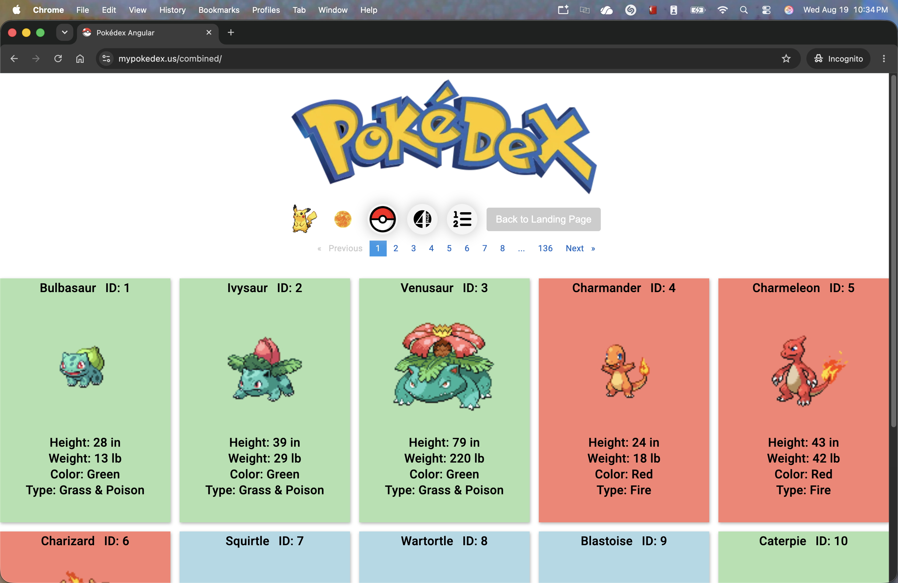

# Pokédex Combined (Angular + Spring Boot)

 

#### Versions

- Angular Front End, Spring Boot Back End
- Inception Year: 2024
- Angular CLI: 20.x
- TypeScript: 5.x (version check: npx tsc -v)
- Node: 24.x (node -v)
- Package Manager: npm 11.x (npm -v)

This project was generated with [Angular CLI](https://github.com/angular/angular-cli) version 15.0.2.
This project works specifically with the PokedexApi project. This is the front end
of the application while the PokedexApi is the back end.

## Development server

Run `ng serve` for a dev server. Navigate to `http://localhost:4203/`. The application will automatically reload if you
change any of the source files.

The default port is set to 4203.
The proxy.conf.js file is used to redirect calls to the backend server. Referenced in angular.json.

## Debugging the UI

To debug the Angular application, we can create a run configuration which will also launch a JavaScript
debugger for us. First, create a new Run Configuration for npm. Set the command to "run" and the
script to "start". Start calls `ng serve` under the hood. Add the following arguments as well:

- --source-map
- --open
- POKEDEX_PROXY=prod (Only if you want to use the production url for the backend)

Next, click on `Browser/Live Edit` tab and enable opening the browser after launch. Set the browser to
any that is allowed. Set the URL to `http://localhost:4203/`. Apply and save the configuration.
Last, create a JavaScript Debug configuration. Give it a name, set the browser the the URL to the same
one as before: `http://localhost:4203/`. Apply and save the configuration.
When you start the npm run configuration, it will launch the browser, follwed by the JavaScript
debug configuration, which attaches itself to the browser session.

## Code scaffolding

Run `ng generate component component-name` to generate a new component. You can also use
`ng generate directive|pipe|service|class|guard|interface|enum|module`.

## Build

Run `ng build` to build the project. The build artifacts will be stored in the `dist/` directory.

Run `ng build-server` to build the project for server-side rendering. The build artifacts will be 
stored in the `dist/` directory. The pokedexapiui folder will contain a /broswer directory. That
is what will be uploaded to the server. All files inside will be extracted and moved into the
/combined directory.
Login to the server using sftp. 
Execute put -r (/dist)/pokedexapiui /opt/tomcat11/combined
This should successfully upload all the files inside the pokedexapiui folder to the server. Extract the files
in the /browser directory and move them up one level to the /combined directory. 
Delete the pokedexapiui folder and the browser folder.
The server will need to be configured to serve the files in the combined directory.

## Running unit tests

Run `ng test` to execute the unit tests via [Karma](https://karma-runner.github.io).

## Running end-to-end tests

Run `ng e2e` to execute the end-to-end tests via a platform of your choice. To use this command, you need to first add a
package that implements end-to-end testing capabilities.

## Further help

To get more help on the Angular CLI use `ng help` or go check out
the [Angular CLI Overview and Command Reference](https://angular.io/cli) page.
